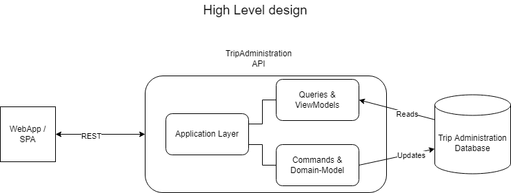
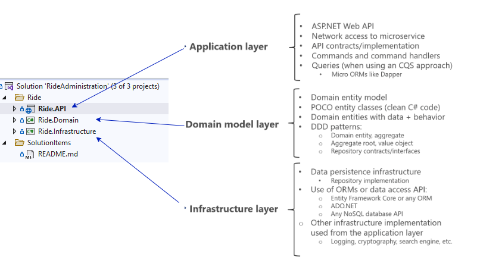
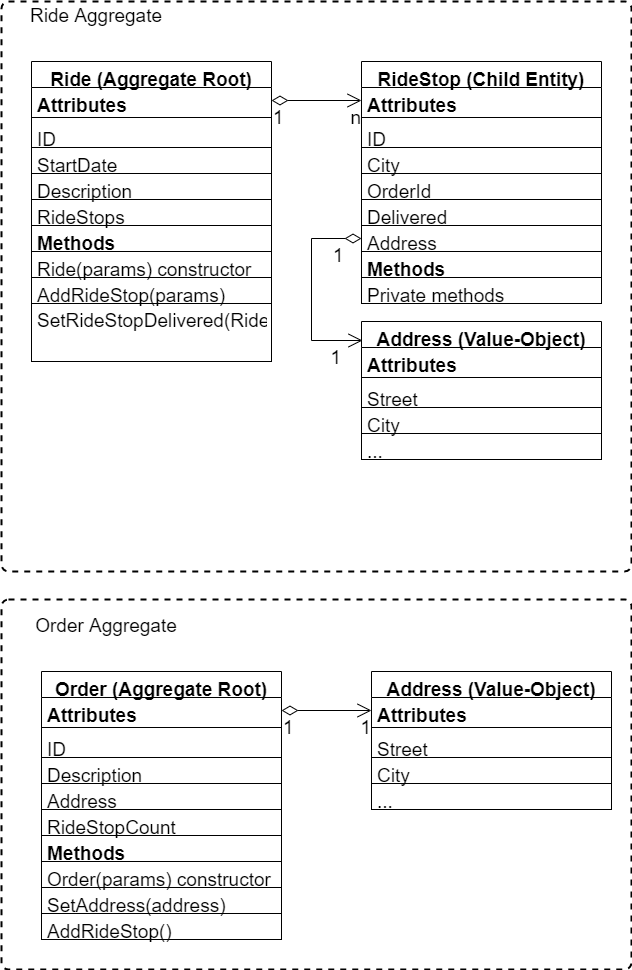

# Trip Administration

## High Level design

## Layers

image.png
## Domain model
### Aggregates

### Getting started
- Plural sight: https://www.pluralsight.com/courses/fundamentals-domain-driven-design
- Reference implementation from Microsoft: https://github.com/dotnet-architecture/eShopOnContainers
- Visual studio 2022 installed
- Dotnet-ef tool installed `dotnet tool install -g dotnet-ef`
- Update Database `dotnet ef database update --project Ride.Infrastructure --startup-project Ride.API`

- Add migration when database model has changed
`dotnet ef migrations add MiogrationName --project Ride.Infrastructure --startup-project Ride.API`

### Assignment
- Implemenent `Ride` and `RideStops`
    - New `Ride`
    - Add `RideStop`
    - Set `RideStop` Delivered
    - Update `Order` with `RideStop Count` (through domain event)
- Extend the application to support the following features:
    - Add a `Driver` to the `Ride`
    - When all `RideStops` are delivered update the Order with `OrderStatus` Complete
    - When an `Order` is completed it is not possible to add new `RideStops`
- Containerize the application with the following features
    - Add docker support for the API project
    - implement docker compose
    - Add SQL Server to docker compose
    - use database from docker in application
